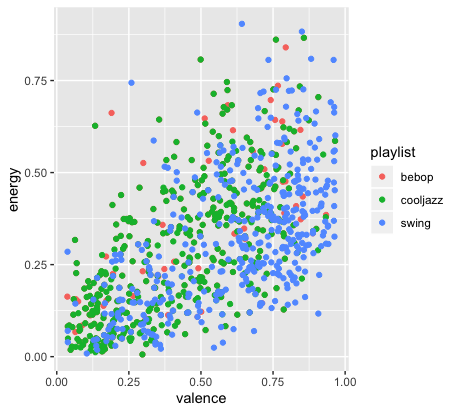
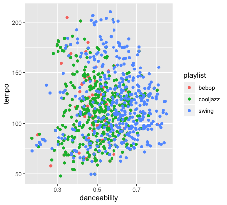

## Assignment 1

For my portfolio I want to check out and compare playlists of different jazz genres, and see whether Spotify recognizes similar characteristic differences between the styles in their measured features as expected in these genres. I found a couple of playlists to research; a few from Spotify, “the sound of…” playlists, and playlists from the Lincoln Center, a famous jazz venue in the USA. For this comparison it seems to me that the best styles to research are the most common and famous and big directions in jazz: swing, bebop, cool jazz and maybe hardbop as well. A difference to expect would for example be danceability between swing and cool jazz, as swing originated as dance music and later jazz changed more to a concert style of music. For now I compared the “the sound of…” playlists. In order to do so I took the means of features that seemed relevant to see if there were any points of interest.

           Cool Jazz   Bebop    Swing
                                
Danceability | 0,511 |  0,510 |  0,592

Energy       | 0,283 |  0,306  |  0,324

loudness                      |  -15,3      |         -14,7           |     -12,6

Liveness                        0,155     |          0,157        |        0,182

Valence                         0,430      |         0,444       |        0,618

Tempo                           112        |         113        |        120

Tracks with odd time            6         |          4          |        2

The summarize command doesn’t seem to work on the bebop playlist and I can’t seem to fix it it. If I view the list the data is there however (It's fixed now!)... The comparison between cool jazz and swing does however give the expected results. Danceability, energy and valence are higher in swing, as one would expect it to be in dance music. Also there are less tunes with odd time signature in swing, which I’d say would also be more expected in dance music. I noticed however that one of the tunes that was listed as odd time signature tune in the bebop list was Take Five by the Dave Brubeck Quartet. I don’t think that Take Five could be classified as bebop tune in anyway, so this raises the question whether these list are made carefully enough and with what criteria the tunes are divided among the styles.

## Assignment 2

These two scatterplots visualize the findings from the first assignment. The differences between the styles are as expected, although the differences are not actually that big: swing is more danceable and has more valence than bebop and cooljazz and energy is lowest in cooljazz. A point of interest is that the scatterplot of energy and valence seems to suggest a positive correlation between the two. Although this is ofcourse not enough evidence, this could mean that Spotify uses one of these features to compute the other one.

