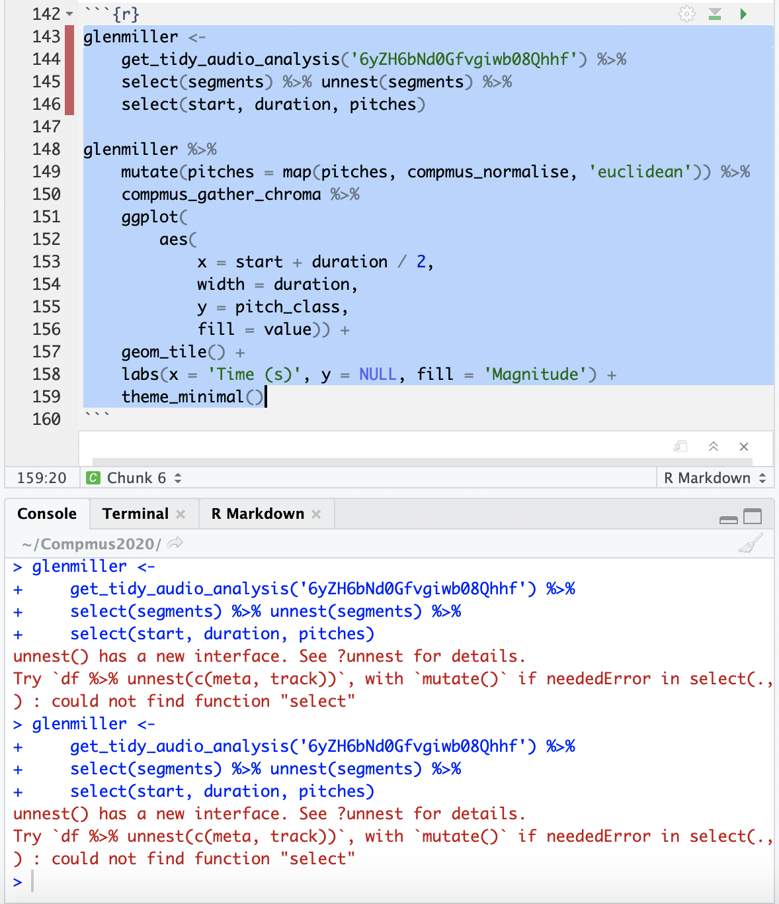

```{r setup, include=FALSE}
library(flexdashboard)
```


### Preparations

```{r}
library(tidyverse)
library(spotifyr)
library(compmus)

Sys.setenv(SPOTIFY_CLIENT_ID = 'fa5df116b34e4a778f295a41cd8d258b')
Sys.setenv(SPOTIFY_CLIENT_SECRET = 'd37387cf974844cebe470406970c19ee')

bebop <- get_playlist_audio_features('thesoundsofspotify', '55s8gstHcaCyfU47mQgLrB')
swing <- get_playlist_audio_features('thesoundsofspotify', '20CFvOMJgvNmysKxUH5GJV')
cool <- get_playlist_audio_features('thesoundsofspotify', '3RtFvzIXD7ulUCXkWdIOWW')

jazzstyles <-
    bebop %>% mutate(playlist = "bebop") %>%
    bind_rows(swing %>% mutate(playlist = "swing")) %>%
    bind_rows(cool %>% mutate(playlist = "cool"))
```

***
In this code I load the packages that are needed, acces my spotify account, and download and merge the data that is relevent for the research.
***


### assignment 1

```{r}
danceability_bebop <-
  bebop %>% summarise(M = mean(danceability, na.rm = TRUE), SD =               sd(danceability, na.rm = TRUE))
danceability_swing <-
  swing %>% summarise(M = mean(danceability, na.rm = TRUE), SD =               sd(danceability, na.rm = TRUE))
danceability_cool <-
 cool %>% summarise(M = mean(danceability, na.rm = TRUE), SD =               sd(danceability, na.rm = TRUE))
danceability <-
 danceability_bebop %>% mutate(playlist = "bebop") %>%
 bind_rows(danceability_cool %>% mutate(playlist = "cool")) %>%
 bind_rows(danceability_swing %>% mutate(playlist = "swing"))


energy_bebop <-
  bebop %>% summarise(M = mean(energy, na.rm = TRUE), SD =                     sd(energy, na.rm = TRUE))
energy_swing <-
  swing %>% summarise(M = mean(energy, na.rm = TRUE), SD =                     sd(energy,       na.rm = TRUE))
energy_cool <-
  cool %>% summarise(M = mean(energy, na.rm = TRUE), SD =                     sd(energy, na.rm = TRUE))
energy <-
 energy_bebop %>% mutate(playlist = "bebop") %>%
 bind_rows(energy_cool %>% mutate(playlist = "cool")) %>%
 bind_rows(energy_swing %>% mutate(playlist = "swing"))
  

loudness_bebop <-  
bebop %>% summarise(M = mean(loudness, na.rm = TRUE), SD = sd(loudness, na.rm = TRUE))
loudness_swing <-
swing %>% summarise(M = mean(loudness, na.rm = TRUE), SD = sd(loudness, na.rm = TRUE))
loudness_cool <-
cool %>% summarise(M = mean(loudness, na.rm = TRUE), SD = sd(loudness, na.rm = TRUE))
loudness <-
 loudness_bebop %>% mutate(playlist = "bebop") %>%
 bind_rows(loudness_cool %>% mutate(playlist = "cool")) %>%
 bind_rows(loudness_swing %>% mutate(playlist = "swing"))

valence_bebop <-
bebop %>% summarise(M = mean(valence, na.rm = TRUE), SD = sd(valence))
valence_swing <-
swing %>% summarise(M = mean(valence, na.rm = TRUE), SD = sd(valence))
valence_cool <-
cool %>% summarise(M = mean(valence, na.rm = TRUE), SD = sd(valence))
valence <-
 valence_bebop %>% mutate(playlist = "bebop") %>%
 bind_rows(valence_cool %>% mutate(playlist = "cool")) %>%
 bind_rows(valence_swing %>% mutate(playlist = "swing"))

tempo_bebop <-
bebop %>% summarise(M = mean(tempo, na.rm = TRUE), SD = sd(tempo, na.rm = TRUE))
tempo_swing <-
swing %>% summarise(M = mean(tempo, na.rm = TRUE), SD = sd(tempo, na.rm = TRUE))
tempo_cool <-
cool %>% summarise(M = mean(tempo, na.rm = TRUE), SD = sd(tempo, na.rm = TRUE))
tempo <-
 tempo_bebop %>% mutate(playlist = "bebop") %>%
 bind_rows(tempo_cool %>% mutate(playlist = "cool")) %>%
 bind_rows(tempo_swing %>% mutate(playlist = "swing"))
```
```{r}
danceability %>%
   ggplot(aes(x = playlist, y = M)) + geom_bar(stat = "identity") + labs(title = 'danceability')

energy %>%
  ggplot(aes(x = playlist, y = M)) + geom_bar(stat = "identity") + labs(title = 'energy')

loudness %>%
  ggplot(aes(x = playlist, y = M)) + geom_bar(stat = "identity") + labs(title = 'loudness')

valence %>%
  ggplot(aes(x = playlist, y = M)) + geom_bar(stat = "identity") + labs(title = 'valence')

tempo %>%
  ggplot(aes(x = playlist, y = M)) + geom_bar(stat = "identity") + labs(title = 'tempo')
```

***
For my portfolio I want to check out and compare playlists of different jazz genres, and see whether Spotify recognizes similar characteristic differences between the styles in their measured features as expected in these genres. The playlist I am going to use are the "sound of.." playlists. For this comparison it seems to me that the best styles to research are the most common and famous and big directions in jazz: swing, bebop, cool jazz. A difference to expect would for example be danceability between swing and cool jazz, as swing originated as dance music and later jazz changed more to a concert style of music. In order to do so I took the means of features that seemed relevant to see if there were any points of interest.

The comparison between cool jazz and swing does however give the expected results. Danceability, energy and valence are higher in swing, as one would expect it to be in dance music. Also there are less tunes with odd time signature in swing, which I’d say would also be more expected in dance music. I noticed however that one of the tunes that was listed as odd time signature tune in the bebop list was Take Five by the Dave Brubeck Quartet. I don’t think that Take Five could be classified as bebop tune in anyway, so this raises the question whether these list are made carefully enough and with what criteria the tunes are divided among the styles.
***


### assignment 2

```{r}
jazzstyles %>%
  ggplot(aes(x = valence, y = energy, color = playlist)) + geom_point()

jazzstyles %>%
  ggplot(aes(x = danceability, y = tempo, color = playlist)) + geom_point()
```

***
These two scatterplots visualize the findings from the first assignment. The differences between the styles are as expected, although the differences are not actually that big: swing is more danceable and has more valence than bebop and cooljazz and energy is lowest in cooljazz. A point of interest is that the scatterplot of energy and valence seems to suggest a positive correlation between the two. Although this is ofcourse not enough evidence, this could mean that Spotify uses one of these features to compute the other one.
***

### assignment 3

```{r}
glenmiller <- 
    get_tidy_audio_analysis('6yZH6bNd0Gfvgiwb08Qhhf') %>% 
    select(segments) %>% unnest(segments) %>% 
    select(start, duration, pitches)

glenmiller %>% 
    mutate(pitches = map(pitches, compmus_normalise, 'euclidean')) %>% 
    compmus_gather_chroma %>% 
    ggplot(
        aes(
            x = start + duration / 2, 
            width = duration, 
            y = pitch_class, 
            fill = value)) + 
    geom_tile() +
    labs(x = 'Time (s)', y = NULL, fill = 'Magnitude') +
    theme_minimal()
```

***
I can't seem to make a chromagram the right way. I downloaded and installed the compmuspackage, but I keep getting the seem error and I haven't been able to fix it... If I knit my file I do get a chromagram as you can see but it doesn't work for me in R... I put a screenshot of the error in the next tab. Help would be greatly appreciated!
***

### error assignment 3 chroma




